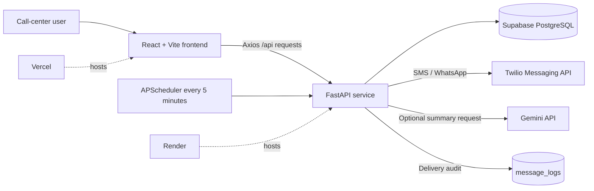

# Architecture

## Request Flow

1. The React form converts browser-local date and time to an ISO UTC value.
2. FastAPI validates the phone number and future appointment time.
3. The API attempts an optional Gemini summary, using fallback text on failure.
4. Supabase persists the appointment.
5. The configured messaging mode sends a mock, SMS, WhatsApp, or both-channel confirmation.
6. The dashboard refreshes appointments and analytics every five seconds.
7. APScheduler scans unsent appointments every five minutes.
8. Successful reminders update the channel-specific flag and visible status.

## Frontend Boundaries

- `components/` contains reusable presentation and form UI.
- `services/` owns HTTP calls and shared error normalization.
- `hooks/useAppointments.js` owns dashboard data state and polling.
- `pages/` compose components for each route.

## Failure Isolation

The database is the source of truth. Twilio and Gemini calls are best-effort,
logged integrations. Their failures do not discard a successfully created
appointment.

Channel-specific delivery flags prevent a successful channel from being sent
again when `both` mode retries another channel that previously failed.
